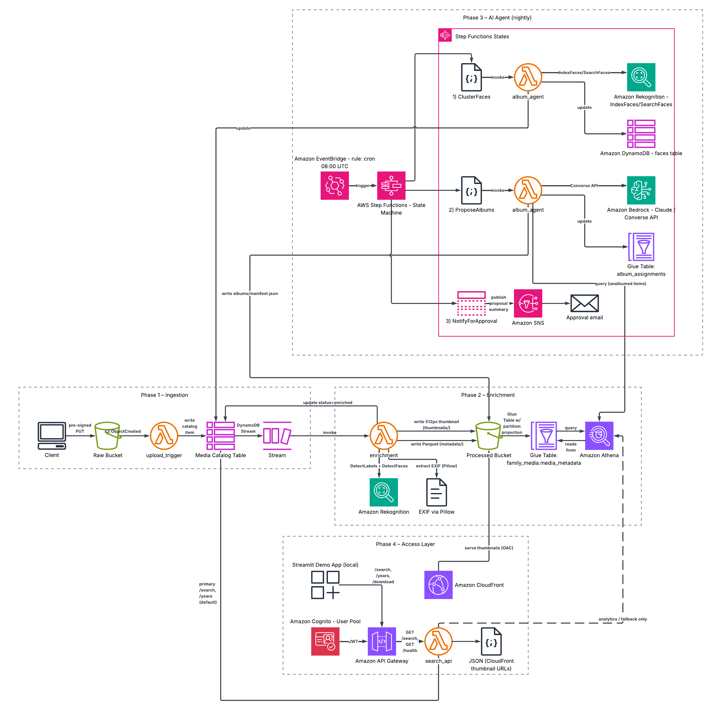

# Family Media Data Lake

A self-hosted alternative to Google Photos, built on AWS as a **Data Engineering
portfolio project**. Originals land in S3, get enriched with Rekognition + EXIF,
indexed in a Glue/Athena lakehouse, organized into albums by a Claude-powered
agent (via Amazon Bedrock), and served through CloudFront + a search API.

**Stack:** Python 3.11 · Terraform · S3 · Lambda · DynamoDB · Rekognition · Glue ·
Athena · Step Functions · API Gateway · CloudFront · Cognito · Bedrock · SNS

All infrastructure is Terraform — no ClickOps, no CDK/SAM. Four phases, one
`terraform apply` from a clean AWS account (after bootstrap).

## Portfolio screenshots

> Drop images into [`docs/screenshots/`](docs/screenshots/). Filenames match the
> tags below. See [screenshot checklist](#screenshot-checklist) at the bottom.

| | |
|---|---|
|  |  |
| *Architecture & data flow* | *Family search demo* |

<!-- screenshot:01-architecture — AWS/console or diagram: full pipeline raw → enriched → agent → access -->
<!-- screenshot:12-streamlit-search — Streamlit grid with thumbnails after label search -->

## Architecture

```
            pre-signed PUT
  client ───────────────────►  S3 raw bucket
                                   │  s3:ObjectCreated
                                   ▼
                          upload_trigger Lambda ──► DynamoDB catalog
                                   │  (Phase 2)
                                   ▼
                          enrichment Lambda ──► Rekognition + EXIF
                                   │            └► Parquet ► S3 processed
                                   ▼
                          Glue table ◄──── Athena
                                   ▲
            (Phase 3) Step Functions nightly ─► album_agent (Bedrock/Claude)
                                                     └► SNS approval email
            (Phase 4) CloudFront + API Gateway + Cognito ─► search_api Lambda
```


<!-- screenshot:02-terraform-modules — terraform/modules tree or terraform plan summary -->

## Build phases

| Phase | Scope | Status |
|------:|-------|--------|
| 1 | S3 lake, DynamoDB catalog, upload trigger, pre-signed URLs | **done** |
| 2 | Rekognition + EXIF enrichment, Parquet, Glue/Athena | **done** |
| 3 | Step Functions, face clustering, Claude album agent, SNS | **done** |
| 4 | CloudFront, API Gateway search, Cognito, Streamlit demo | **done** |

## Repository layout

```
terraform/            Root stack + reusable modules
  bootstrap/          Remote-state bucket + lock table (run FIRST, local state)
  modules/storage/    S3 raw + processed + artifacts buckets, DynamoDB catalog
  modules/ingestion/  upload_trigger Lambda + S3 notification
  modules/enrichment/ enrichment Lambda + Glue table + Athena workgroup
  modules/agent/      nightly Step Functions + album_agent Lambda + SNS
  modules/access/     CloudFront + Cognito + HTTP API + search Lambda
demo/                 Optional Streamlit search UI
lambdas/              One folder per Lambda, each self-contained
scripts/              Pre-signed URL generator, Lambda package builder
step_functions/       nightly_agent.asl.json (templated by Terraform)
tests/                pytest unit tests for Lambda + script logic
```

## Prerequisites

- Terraform >= 1.5
- AWS CLI configured with credentials (`aws sts get-caller-identity` works)
- Python 3.11 (Lambda runtime). Local 3.8+ is fine for the helper scripts/tests.
- Network access at `terraform apply` time: the enrichment and album_agent
  Lambda packages are built locally by `scripts/build_lambda_package.sh`,
  which pip-installs linux/arm64 Python 3.11 wheels (Pillow, pyarrow)
  regardless of your local Python.
- **Bedrock model access** for the configured Claude model must be granted
  once in the AWS console (account-level; not Terraformable) before the
  nightly agent's first run.

## Deploy (Phase 1)

### 1. Bootstrap the remote state backend (one time)

```bash
cd terraform/bootstrap
terraform init
terraform apply        # creates the tfstate bucket + lock table
terraform output       # note state_bucket_name + lock_table_name
```

### 2. Point the root stack at that backend

Edit `terraform/backend.tf` and replace `REPLACE_WITH_ACCOUNT_ID` with your
account id (or pass `-backend-config=...` flags at init — see comments in the
file).

### 3. Deploy the lake

```bash
cd terraform
terraform init         # migrates to the S3 backend
terraform plan
terraform apply
```

Outputs include the raw/processed bucket names, catalog table name, and the
upload-trigger function name.


<!-- screenshot:03-terraform-outputs — terraform output after successful apply -->

## Upload a file

```bash
export RAW_BUCKET="$(terraform -chdir=terraform output -raw raw_bucket_name)"

# Generate a URL and upload in one step:
python scripts/generate_upload_url.py path/to/photo.jpg --uploader ariel --upload
```

The S3 event fires `upload_trigger`, which writes a catalog item to DynamoDB.
Check it:

```bash
aws dynamodb scan --table-name "$(terraform -chdir=terraform output -raw catalog_table_name)" --max-items 5
```


<!-- screenshot:04-upload-catalog — S3 object under raw/year=…/ plus DynamoDB item status=uploaded -->

## Enrichment pipeline (Phase 2)

The catalog INSERT flows through the DynamoDB stream into the `enrichment`
Lambda, which:

1. extracts EXIF (capture timestamp + GPS) with Pillow,
2. writes a 512px JPEG thumbnail to `processed/thumbnails/...`,
3. calls Rekognition `DetectLabels` + `DetectFaces` (photos only; videos are
   cataloged but skip Rekognition — video analysis is async and pricier),
4. writes a one-row Parquet file to `processed/metadata/year=.../...parquet`,
5. flips the catalog item to `status=enriched` with denormalized highlights.

The Glue table `family_media.media_metadata` sits over the metadata prefix
using **partition projection** — there is no crawler to run or pay for;
new partitions are queryable immediately.


<!-- screenshot:05-enrichment-pipeline — processed/thumbnails + metadata parquet + catalog status=enriched -->

### Query with Athena

```bash
WG="$(terraform -chdir=terraform output -raw athena_workgroup_name)"

aws athena start-query-execution \
  --work-group "$WG" \
  --query-execution-context Database=family_media \
  --query-string "
    SELECT file_id, original_filename, capture_ts, rekognition_labels
    FROM media_metadata
    WHERE year = 2026 AND month = 6
      AND contains(rekognition_labels, 'Beach')
    LIMIT 50;"
```

Two ready-made named queries (`photos-by-label`, `face-stats-by-day`) are
provisioned in the workgroup. **Always filter on `year`/`month`/`day`** —
Athena bills per byte scanned, and the workgroup enforces a 1 GiB per-query
cutoff as a backstop.


<!-- screenshot:06-athena-query — Athena editor: label search with partition filters + results grid -->

### Known limitations (deliberate deferrals)

- HEIC/HEIF: Pillow can't decode them without `pillow-heif`, and Rekognition
  doesn't accept them — such files are cataloged with null EXIF/labels.
- `location_name` stays null until a reverse-geocoding source is wired up
  (Amazon Location / Nominatim — external cost/ToS decision).
- The `face_id`s in the metadata parquet are per-photo placeholders; stable
  person identities live in the Phase 3 faces table (`cluster_id`).

## AI agent (Phase 3)

Every night (08:00 UTC by default), EventBridge starts the
`family-media-nightly-agent` Step Functions workflow:

1. **ClusterFaces** — `album_agent {action: cluster_faces}` indexes new
   enriched photos into a Rekognition face collection and groups faces into
   person clusters (SearchFaces, threshold 90). Mapping persisted in the
   `family-media-faces` table; `face_cluster_ids` denormalized onto the
   catalog.
2. **ProposeAlbums** — `album_agent {action: propose_albums}` compacts
   unalbumed items (date, labels, people clusters, GPS) into JSON and asks
   Claude (Bedrock Converse API) for album proposals. Hallucinated file ids
   and undersized albums are dropped. Valid albums are written as
   `albums/<album_id>/manifest.json` (status=proposed), appended to the
   `family_media.album_assignments` Glue table (join on `file_id`), and
   `album_ids` updated on catalog items.
3. **NotifyForApproval** — the proposal summary is published to the SNS
   topic (set `approval_email` in Terraform and confirm the subscription).

Run it manually any time:

```bash
aws stepfunctions start-execution \
  --state-machine-arn "$(terraform -chdir=terraform output -raw nightly_agent_state_machine_arn)"
```

Query album contents via Athena:

```sql
SELECT a.album_name, m.original_filename, m.capture_ts
FROM album_assignments a
JOIN media_metadata m ON m.file_id = a.file_id
WHERE m.year = 2026 AND m.month = 6;
```

Tuning knobs (Terraform variables): `bedrock_model_id`, `approval_email`,
`agent_schedule_expression`, `agent_schedule_enabled`.


<!-- screenshot:07-step-functions-agent — SFN graph: ClusterFaces → ProposeAlbums → SNS, execution succeeded -->


<!-- screenshot:08-album-proposal — albums/…/manifest.json in S3 or SNS approval email body -->

## Family access (Phase 4)

- **CloudFront** (`PriceClass_100`) serves `thumbnails/*` from the processed
  bucket via Origin Access Control. Metadata and originals are not exposed.
- **Cognito** user pool with admin-only account creation (no public sign-up).
- **HTTP API** (API Gateway v2) with a JWT authorizer on `GET /search`;
  `GET /health` is open for liveness checks.
- **search_api Lambda** runs partition-pruned Athena queries and returns JSON
  with CloudFront thumbnail URLs.

### Create a family user

```bash
POOL="$(terraform -chdir=terraform output -raw cognito_user_pool_id)"
aws cognito-idp admin-create-user \
  --user-pool-id "$POOL" \
  --username "you@example.com" \
  --user-attributes Name=email,Value=you@example.com Name=email_verified,Value=true \
  --temporary-password 'ChangeMeNow1!' \
  --message-action SUPPRESS

aws cognito-idp admin-set-user-password \
  --user-pool-id "$POOL" \
  --username "you@example.com" \
  --password 'YourSecurePass1!' \
  --permanent
```

### Search via API

```bash
API="$(terraform -chdir=terraform output -raw search_api_endpoint)"
CLIENT="$(terraform -chdir=terraform output -raw cognito_client_id)"
TOKEN="$(aws cognito-idp initiate-auth \
  --client-id "$CLIENT" \
  --auth-flow USER_PASSWORD_AUTH \
  --auth-parameters USERNAME=you@example.com,PASSWORD='YourSecurePass1!' \
  --query 'AuthenticationResult.IdToken' --output text)"

curl -s -H "Authorization: Bearer $TOKEN" \
  "$API/search?year=2026&month=6&label=Person" | jq .
```

### Streamlit demo (family-friendly browse UI)

Instagram-style grid: photos load on sign-in (20 per page), **year buttons** at the
top, optional **tag search** in the sidebar, **Previous / Next** pagination, and
**Download original** per photo (presigned URL from the API).

```bash
export SEARCH_API_URL="$(terraform -chdir=terraform output -raw search_api_endpoint)"
export COGNITO_CLIENT_ID="$(terraform -chdir=terraform output -raw cognito_client_id)"
pip install -r demo/requirements.txt
streamlit run demo/app.py
```

API routes: `GET /search?page=1&year=all`, `GET /years`, `GET /download?file_id=…`

See `demo/README.md` for details.


<!-- screenshot:09-access-layer — CloudFront distribution, HTTP API routes, Cognito user pool -->


<!-- screenshot:10-api-search-response — curl or Postman: GET /search with JWT, jq showing thumbnail_url -->


<!-- duplicate anchor OK — main hero uses same file -->

## Tests

```bash
python -m venv .venv && source .venv/bin/activate
pip install -r requirements-dev.txt
pytest -q
```


<!-- screenshot:11-pytest-ci — terminal: pytest -q showing 70 passed (or GitHub Actions if you add CI) -->

## Conventions

- Each Lambda owns its `requirements.txt`; Terraform `archive_file` zips it.
- Handlers: validate event → log → business logic → return response.
- Structured JSON logs: `{"level","function","message", ...}`.
- All names/ARNs/model-ids come from Lambda env vars set by Terraform.
- Parquet via `pyarrow` (Phase 2), never pandas, to keep packages lean.
- Every module outputs its ARNs + names for clean cross-module references.

## Cost notes

Designed to be near-zero at low usage:

- **S3 Intelligent-Tiering** on both buckets caps storage cost as the library
  grows (no retrieval fees between frequent/infrequent tiers). Raw originals
  additionally roll into IT Archive/Deep-Archive tiers after 90/180 days —
  those require an async restore before download (thumbnails stay in the
  processed bucket precisely so they remain instant).
- **DynamoDB** is on-demand (PAY_PER_REQUEST): no idle cost. PITR + streams add
  only negligible cost for a small catalog.
- **Lambda** stays within the free tier at family-scale volume; arm64 + 256 MB.
- **CloudWatch Logs** retention is capped (14 days default) to bound log spend.

Phase 2 specifics:

- **Rekognition is per-call**: DetectLabels + DetectFaces ≈ **$2 per 1,000
  photos**. Negligible at family upload rates, but bulk-importing a large
  archive (e.g. 20k photos ≈ $40) is a conscious decision — throttle or
  disable the stream trigger first if you don't want that.
- **Athena bills per byte scanned**: the workgroup enforces a 1 GiB/query
  cutoff, results expire from S3 after 7 days, and the table uses partition
  projection so there's no crawler cost at all.
- **Glue catalog**: first 1M objects/requests are free — effectively $0 here.

Phase 3 specifics:

- **Bedrock (Claude)** is per-token. The default Claude 3.5 Haiku with a
  capped payload (≤300 items/run) costs ~$0.02/night ≈ **$0.60/month**.
  Swapping `bedrock_model_id` to a Sonnet-class model is roughly 10x.
  Runs with fewer than 5 unalbumed items skip the Bedrock call entirely.
- **Rekognition IndexFaces/SearchFaces** ≈ $2 per 1,000 new face photos —
  each photo is indexed exactly once (`faces_indexed` flag).
- **Step Functions / EventBridge / SNS**: one standard-workflow run per night
  is fractions of a cent per month.
- Set `agent_schedule_enabled = false` to keep everything deployed but only
  run the agent manually.

Phase 4 specifics:

- **CloudFront**: first 1 TB/month egress free, then ~$0.085/GB — family
  thumbnail browsing is effectively $0. No custom domain (avoids Route53/ACM).
- **API Gateway HTTP API**: ~$1 per million requests — negligible.
- **Cognito**: first 50k MAU free; a handful of family accounts is $0.
- Search queries still bill through **Athena** — always pass `year` (and
  `month`/`day` when you can) to keep scans small.

## Screenshot checklist

Capture these after a live deploy (filenames must match `docs/screenshots/`):

| # | File | What to capture |
|---|------|-----------------|
| 01 | `01-architecture.png` | **Architecture diagram** — draw.io/Lucidchart or AWS console collage showing S3 → Lambda → DynamoDB → Glue/Athena → Bedrock → CloudFront. This is the hero image for recruiters. |
| 02 | `02-terraform-modules.png` | **IaC structure** — `tree terraform/modules` in terminal or Terraform Cloud/plan showing module graph. Proves modular design. |
| 03 | `03-terraform-outputs.png` | **`terraform output`** — bucket names, API endpoint, Cognito ids, state machine ARN. Shows one-command deploy. |
| 04 | `04-upload-catalog.png` | **Ingestion** — S3 Console on `raw/year=…/` object + DynamoDB item (`status=uploaded`, `file_id`, `uploader`). |
| 05 | `05-enrichment-pipeline.png` | **Silver layer** — S3 `thumbnails/` + `metadata/…parquet` + DynamoDB `status=enriched` with `rekognition_labels`. |
| 06 | `06-athena-query.png` | **Lakehouse query** — Athena editor running a partition-pruned query (e.g. `contains(rekognition_labels, '…')`) with results. |
| 07 | `07-step-functions-agent.png` | **Orchestration** — Step Functions execution view with green states for ClusterFaces → ProposeAlbums → NotifyForApproval. |
| 08 | `08-album-proposal.png` | **AI output** — `manifest.json` in S3 (`status=proposed`) or SNS email with album names. |
| 09 | `09-access-layer.png` | **Serving layer** — CloudFront distribution + API Gateway routes (`/search`, `/health`) + Cognito user pool. |
| 10 | `10-api-search-response.png` | **API contract** — `curl`/`jq` on `GET /search` with Bearer token; show `thumbnail_url` pointing at CloudFront. |
| 11 | `11-pytest-ci.png` | **Quality** — `pytest -q` all green (optionally GitHub Actions badge later). |
| 12 | `12-streamlit-search.png` | **Demo UI** — Streamlit after login: search filters + 4-column thumbnail grid. Best “product” shot for LinkedIn. |

**Optional bonus shots** (not wired in README yet): CloudWatch Logs Insights on structured JSON (`file_id`, `function`); Glue table **partition projection** parameters; Rekognition face collection face count; Cost Explorer monthly total (proves “near-zero” claim).
